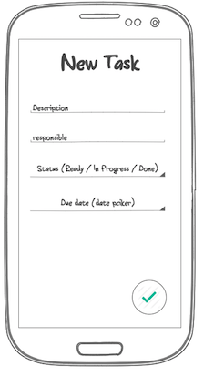
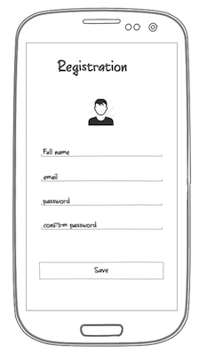
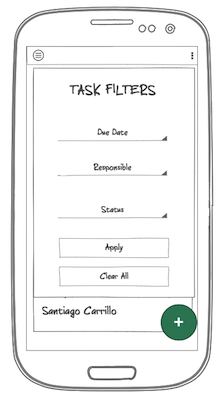

# Task Planner Project - Front End - Part 2

1. Open the project created on Part 1

2. Create the NewTask.js component and the CSS if needed (use Material-UI library!)



3. Modify the App.js component so it uses *BrowserRouter* to enable the navigation from the + floating action button from the main view to take you to the *NewTask* component (https://reacttraining.com/react-router/web/example/basic)

4. Implement the logic to be able to connect the main view so when you create a new task this task is added to the list on the main view.

Remember the model to represent a task:
  ```javascript
       {
    	"description": "some description text ",
    	"responsible": {
    		"name": "Santiago Carrillo",
    		"email": "sancarbar@gmail"
    	},
    	"status": "ready",
    	"dueDate": 156464645646
    }
```
5. Implement the UserProfile.js component to update the user profile details (make sure this updates your navigationDrawer in your main view):



6. Create a Modal that is display the filter control options (https://material-ui.com/utils/modal/)



7. Implement the logic so when the filters are applied the data is filtered accordingly
